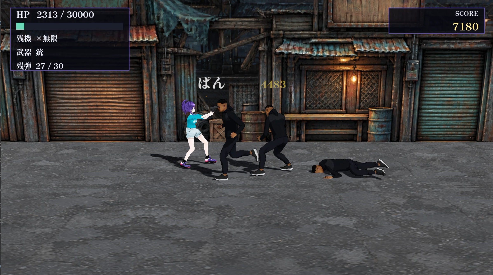
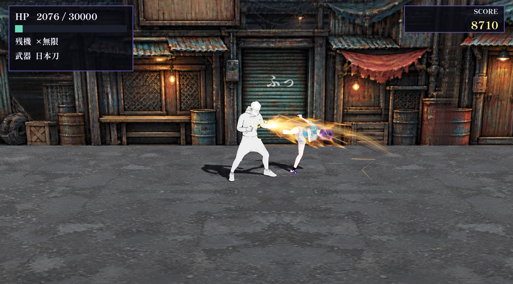
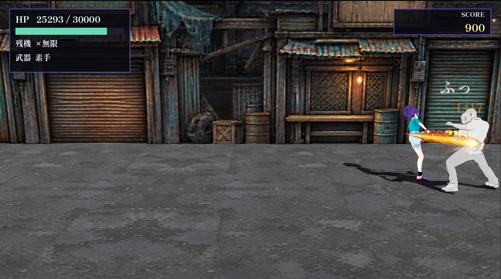

# Seventeen（セブンティーン）

Godot 4.7.1 製のベルトスクロール・アクション。開発者ニケが誘拐され、AIニケちゃんが救出に向かう。5面構成、1本道、通しで 10〜15 分ほど。

本作品は「AIニケちゃん」の非公式ファンメイド作品です。原作・公式とは関係ありません。
This is an unofficial fan-made work of AI Nike-chan. Not affiliated with or endorsed by the creator.

## 内容についての注意

武器（日本刀・銃）を使った戦闘と、流血表現がある。無料配布のみで、課金・広告・投げ銭の類は一切無い。

## 画面







敵が白く見えるのは被弾したときのフラッシュで、0.08 秒で元に戻る。

## 動作環境

|項目|内容|
|---|---|
|OS|Windows / Linux / macOS（いずれも 64bit）|
|GPU|Vulkan 対応のもの|
|入力|キーボード、または PS / Xbox 系のパッド|
|容量|展開後およそ 500MB|

## ダウンロード

[Releases](https://github.com/0x006a6d/17/releases/latest) から、使っている OS の zip を1つ落とす。

|ファイル|対象|
|---|---|
|`Seventeen-v1.0.0-windows.zip`|Windows 64bit|
|`Seventeen-v1.0.0-linux.zip`|Linux 64bit|
|`Seventeen-v1.0.0-macos.zip`|macOS（署名なし）|

SHA-256 は Release ページの `SHA256SUMS.txt` に載せてある。

## インストール

インストーラは無い。zip を展開してそのまま起動する。設定ファイルやセーブデータは作らないので、遊び終わったらフォルダごと消せば残らない。

### Windows

1. zip を右クリック →「すべて展開」で好きな場所に展開する
2. 中に `Seventeen.exe` と `Seventeen.pck` が並んで入っている。この2つは同じフォルダに置いたままにする（`.pck` にゲームの中身が全部入っているので、離すと起動しない）
3. `Seventeen.exe` を実行する

SmartScreen の警告が出たら「詳細情報」→「実行」を選ぶ。署名を買っていないため出る。

### Linux

```
unzip Seventeen-v1.0.0-linux.zip
chmod +x Seventeen.x86_64
./Seventeen.x86_64
```

`Seventeen.x86_64` と `Seventeen.pck` は同じ場所に置いたままにする。

### macOS

1. zip を展開すると `セブンティーン.app` が出る
2. ダブルクリックでは開かない。右クリック（または control + クリック）→「開く」→ 確認のダイアログで「開く」を選ぶ

署名していないため、通常のダブルクリックでは Gatekeeper に止められる。この手順は初回だけでよい。

## 操作

|操作|キーボード|パッド|
|---|---|---|
|移動（左右）|A D|左スティック / 十字キー 左右|
|移動（奥・手前）|W S|左スティック / 十字キー 上下|
|パンチ|J|□|
|キック|K|×|
|武器を使う（斬る・撃つ）|U|R2|
|銃をリロードする|R|L2|
|武器を持ち替える（素手 → 日本刀 → 銃）|Tab|L1|
|回避する（バックフリップ）|Space|R1|
|必殺（回転飛び蹴り。HP を少し使う）|O|△|
|踊る（回復）|E 長押し|○ 長押し|
|決定（タイトル開始・カードを送る・コンティニュー）|Enter / Space|○ / Options|
|カードの残りを飛ばす|Esc|△|

タイトル画面で Enter（パッドは ○）を押すと1面が始まる。数値まで含めた一覧は [docs/controls.md](docs/controls.md) にある。

## 遊びかた

### 基本

- 横に進む。上下で奥行きを移動し、奥行きが揃っている相手にだけ攻撃が当たる。奥行きの差が 0.6m を超えていると、自分の攻撃も敵の攻撃も当たらない
- 一定の場所でカメラが止まり、敵が出る。全員倒すと右端に「GO →」が出て先へ進める
- 各面の最後にボスがいる
- 画面左上に HP と残機と武器、上中央に面の題名（ボス戦ではボスの名前と HP バー）、右上に得点が出る
- HP が尽きると残機を1つ失う。残機が尽きるとコンティニュー

### コンボ

パンチ（P）とキック（K）を押す順番でルートが分岐する。ルートに無い入力を押すと、その段で終わって待機に戻る。

|入力|技の並び|
|---|---|
|`P P P`|左ジャブ → 右ストレート → 左フック|
|`K K K`|右膝 → 右ミドル → 右ハイ|
|`P K P P`|左ジャブ → 右膝 → 左ジャブ → 右ストレート|
|`P K K P`|左ジャブ → 右膝 → 右ミドル → 左フック|
|`P P K P K`|左ジャブ → 右ストレート → 右膝 → 左フック → 右ハイ|
|`K P P P K P K`|右膝 → 左フック → 右ストレート → 左ジャブ → 右膝 → 左フック → 右ハイ|

段が終わってからも 0.40 秒は続きを繋げられる。締めの2技（左フック・右ハイ）だけが相手を吹き飛ばすので、途中で当てると次の段が届かなくなる。

### 武器

Tab（L1）を押すたびに 素手 → 日本刀 → 銃 → 素手 と巡回する。持ち替えても銃の残弾は残る。素手のコンボは武器を持っていても出る。

|武器|1発の威力|備考|
|---|---:|---|
|素手（左ジャブ）|1000|段を繋ぐほど得点が伸びる|
|日本刀|4000 / 5000 / 7000|U（R2）連打で3段。リーチは 1.40〜1.90m|
|銃|4500|射程 22m、装弾 30 発、連射 0.28 秒間隔。R（L2）で 1.3 秒かけてリロード|

刀と銃は当たるたびに確率で相手を即死させる（刀 15%、銃 10%）。ボスには効かず、4面では起きない。

### 回避・必殺・回復

|行動|内容|
|---|---|
|回避（Space / R1）|後ろへ 2.85m 跳ぶ。跳んでいる 0.8 秒は全部無敵。次に使えるまで 1.25 秒|
|必殺（O / △）|回転飛び蹴り。威力 5500、自分の周り 2.6m と正面 2.8m に当たる。自分の HP を 1500 使う。再使用まで 1.632 秒|
|回復（E / ○ 長押し）|押している間だけ毎秒 1000 回復する（最大 30000）。止まっていないと始まらず、移動・攻撃・被弾で中断する|

### 得点

|加点|値|
|---|---:|
|素手が当たる|100 × コンボの段数|
|日本刀が当たる|60 × 段数|
|銃が当たる|30|
|敵を倒す|200|
|死亡|−500（0 未満にはしない）|

段を掛けるので、繋げるほど1発の価値が上がる。素手7段なら 100×(1+…+7)=2800 で、単発7回の 700 の4倍になる。得点を狙うなら武器を使わず素手で長く繋ぐ。

## 攻略

### 敵に共通すること

- 一撃ごとには怯まない。短い時間の累計ダメージが一定量を超えたときだけよろける
- よろけて耐えた直後、構えて正面からの近接を弾く。ガードが効くのは正面だけなので、上下で奥行きをずらして背後に回れば通る
- 受け止められたあとは短い予備動作で殴り返してくる。ガードを見たら一度離れる
- 4面のゾンビと5面のニケ素体は怯まない。殴っても止まらないので、回避で距離を取りながら削る

雑魚は HP 30000、素手 1200 前後。突進型だけは、奥行きが揃って距離 2.5〜6.0m のときに 0.5 秒構えてから突っ込んでくる。構えが見えたら奥行きをずらす。

### 1面 ターミナル・スラム

雑魚 10 体。内訳は通常型 9 体と突進型 1 体。

ボスはマスクマン。HP 90000、素手 1800。通常型の大型版で、のけぞりにくく追走が速い（2.6 m/s）。供回りも増援も出ない。素手のコンボで殴り、ガードを固めたら背後に回るだけで倒せる。

### 2面 タイムライン地下鉄

雑魚 13 体。色違いの個体が混ざるが、挙動と数値は元と同じ。

ボスは SWAT。日本刀で 4000 を出してくる。ガードが固く（構える確率 0.75、正面 160°、1.4 秒）、2回受け止められると 0.9 の確率で反撃してくる。正面から押し切ろうとすると刀が返ってくるので、奥行きをずらして側面から入る。

### 3面 Discord湾岸

雑魚 17 体で、この面が一番多い。

ボスは GUNNER。距離 4.5m を保って正面へ銃を 5 発ずつ撃つ（1発 5000、0.18 秒間隔、射程 18m）。雑魚は出ない一騎打ち。

- 5 発は撃ち始めた時点の狙い点へ飛ぶ。撃たれ始めてから奥行きをずらせば、残りは当たらない
- 3.0m まで詰めると下がるが、画面端では下がれずに止まる。端に追い込んでから殴るのが早い

### 4面 工場

雑魚はゾンビ 5 体。接近 1.05 m/s と遅いかわりに怯まず、大振り（予備動作 0.45 秒）で殴ってくる。

ボスはマッドサイエンティスト。AIニケちゃんと同じ姿の身体を正面に抱えて盾にする。

- 盾を構えている間、正面 120° からの近接は弾かれる。側面か背後に回る
- 側面・背後から 3 発当てると盾を離す。離したあとは距離 4.5m を保って撃ってくる（1発 4500、0.9 秒間隔）
- 6 秒後にまた盾を掴みに行くので、その間に詰める
- ボスの HP が 30% を切るとゾンビが 4 体増える

ボス戦の開始と同時にゾンビが 2 体歩き込んでくる。ボスだけを追うと後ろから殴られる。

### 5面 ポーランドの部屋

雑魚の波は無く、最初からボス戦。

ボスはニケ。HP 60000 で、プレイヤーと同じ素手コンボを使う鏡写しの相手。

- 射程 1.35m まで詰めてコンボを出し、0.55m より近いと半歩下がる
- 0.7 秒の間に 2 回当てると 50% でガードに入る（0.9 秒）。向いている側の近接だけを弾くので、回り込めば通る
- 踊って回復しているのを見ると、クールダウンを待たずに詰めてくる。回復するなら距離を取ってから
- HP 50% / 30% / 15% でそれぞれ増援を 2 体呼び、1.6 秒だけ距離を取る。呼ばれた直後は本体を追わず、増援を先に片付けたほうが楽

倒れたら立ち上がらない。

## ドキュメント

- [docs/controls.md](docs/controls.md) — 操作方法の全一覧（入力マップ、コンボツリーの全ルート、武器・回避・必殺の数値）
- [docs/enemies.md](docs/enemies.md) — 敵一覧（雑魚・ボスの数値と、面ごとの出現。画像つき）
- [docs/technical-spec.md](docs/technical-spec.md) — Godot 上の実装仕様
- [docs/asset-credits.md](docs/asset-credits.md) — 使用しているモーション素材と取得元
- [docs/mixamo-retarget.md](docs/mixamo-retarget.md) — Mixamo のモーションを VRM に載せ替える手順

## ライセンス

このリポジトリに置いている文章は [WTFPL](LICENSE)。

ゲームで使っている素材（AIニケちゃんの公式アセット、Mixamo のモーション、フォント、効果音など）は、それぞれ元のライセンスに従う。一覧と出典は [docs/asset-credits.md](docs/asset-credits.md) にある。

## 使用アセット

- AIニケちゃん公式アセット: https://github.com/tegnike/nikechan-assets
- 二次創作ガイドライン: https://nikechan.com/guidelines/derivative

## 制作に使わせてもらったもの

AIニケちゃんの設定と言動を調べるのに、ochisamu さん（[@ochisamu](https://x.com/ochisamu)）の「AIニケちゃん MCP」を使いました。
公式サイトと公開されている X の投稿を、エージェントから読み取り専用で検索できる MCP サーバーです。

- AIニケちゃん MCP: https://ai-nikechan-mcp.vercel.app/setup
- 告知: https://x.com/ochisamu/status/2093291250682093797

AIニケちゃんの Discord サーバーの情報を確認するのに、mori_tuki さん（[@mori_tuki](https://x.com/mori_tuki)）の「おもいでコレクター — AIニケフェス!!」を使いました。

- おもいでコレクター — AIニケフェス!!: https://memories.nectalica.com/
