# 敵一覧

出典は `levels/stage_N.tscn` の波（`LockPoint.waves`）とボス、各敵シーンの数値。画像は
`tools/capture_enemy_cards.gd` で撮ったゲーム内モデル（待機ポーズ、正面）。

```
godot --path . --resolution 700x900 res://tools/capture_enemy_cards.tscn
```

## 共通の仕組み

- 雑魚は最大4体まで同時に出る。画面ロック地点で波が順に出て、全滅すると「GO →」で先へ進める
- 共通挙動（`enemy.gd`）: 接近 → 段（奥行き）を合わせる → 攻撃。段がずれていると攻撃は当たらない
  （`Hitbox.depth_tolerance` 0.6m）。のけぞり耐性（poise）を超えると怯み、HP 0 で倒れてその場に
  留まり、点滅してから 4 秒後に消える
- 4面のゾンビと5面のニケ素体は怯まない（`staggers = false`）。どれだけ殴っても のけぞらず、
  ノックバックも乗らず、歩きも攻撃も止まらない
- 数値の桁は主人公の攻撃（4桁）に合わせてある。HP・威力・のけぞり耐性はすべて同じ倍率なので、
  力関係は桁を落として読める
- 表の威力は基礎値。実際に出る数は1発ごとに +1〜12% 上振れした整数になる（`DamageRoll`）
- ボス戦に出る雑魚は同時2体まで。供回りも増援も、超えた分は誰か倒れてから出てくる
- 4面のボス（盾持ち）は面に置いてあるが、ボス戦の地点に入るまで動かない
- 一度画面に入った敵は画面外へ出ない（出ると追えず倒せなくなるため、プレイヤーと同じ範囲で
  止める）。出現直後の画面外は対象外で、倒れた個体も対象外
- 敵の死亡モーションは共通（Mixamo `Death Crouching Headshot Front`）
- 被弾とダウンで短い掛け声が鳴る（被弾は 0.4 の確率、0.7 秒の間隔を下限にする）
- 各面の頭では、画面上中央に面の題名が 3.5 秒出る（ボス戦に入ると消える）

## 雑魚（1〜3面）

数値は4種とも共通で、HP 30000・poise 2800（回復 2000/秒）・接近 3.2 m/s・奥行き合わせ 2.2 m/s。
攻撃は予備動作 → 判定 → 硬直 → クールダウンの順に進み、距離で3種類を使い分ける。

| 種類 | モデル | HP | 攻撃 | 特徴 |
|---|---|---|---|---|
| 通常A | Ch01 | 30000 | 素手 1200 | 接近して殴る。クロス 1200（0.95〜1.35m）／ジャブ 900（0.90〜1.35m）／フック 1500（〜1.00m）を距離で使い分ける |
| 通常B | Ch28 | 30000 | 素手 1200 | 同上（見た目違い） |
| 通常C | Ch06 | 30000 | 素手 1200 | 同上（見た目違い） |
| 突進 | Ch08 | 30000 | 突進 1400（ノックバック 5.0）／素手 1200 | 段が揃って距離 2.5〜6.0m のとき、0.5秒構えてから 7.0 m/s で 0.55秒突っ込む。突進後 0.9秒硬直、次の突進まで 3秒 |

### 通常A（Ch01）
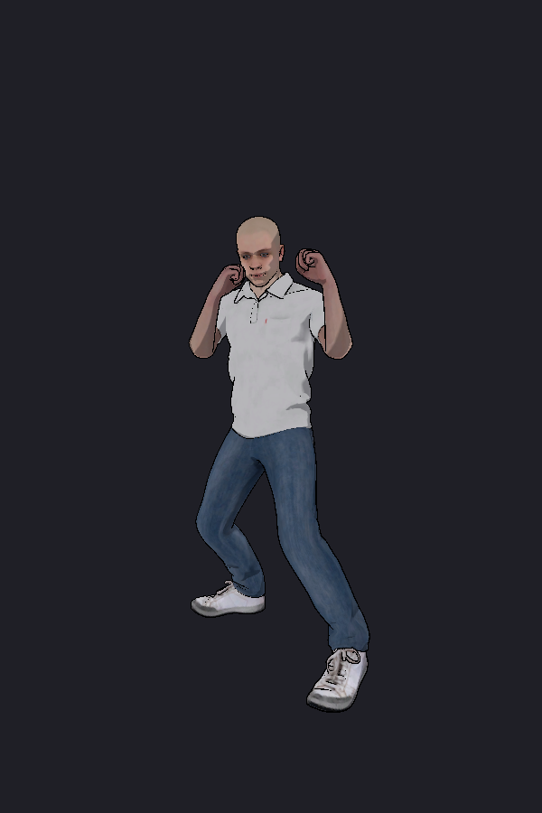

### 通常B（Ch28）
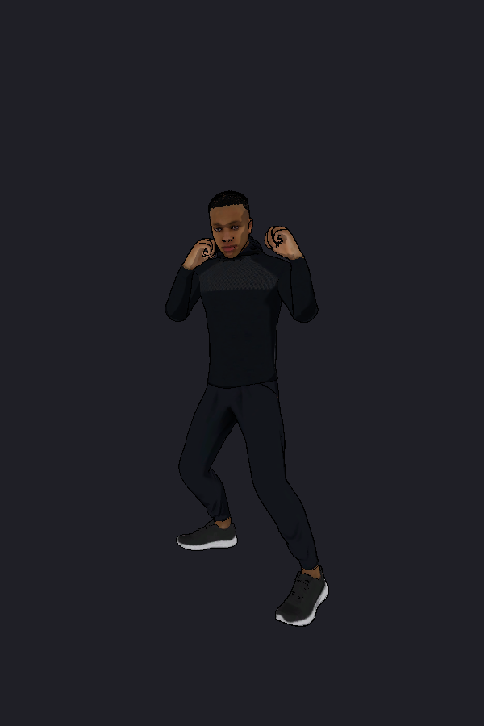

### 通常C（Ch06）
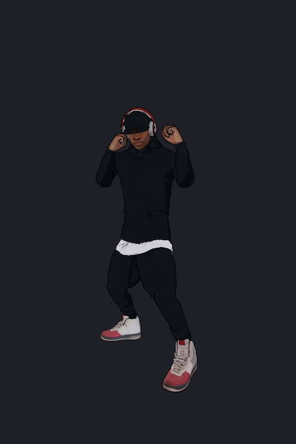

### 突進（Ch08）
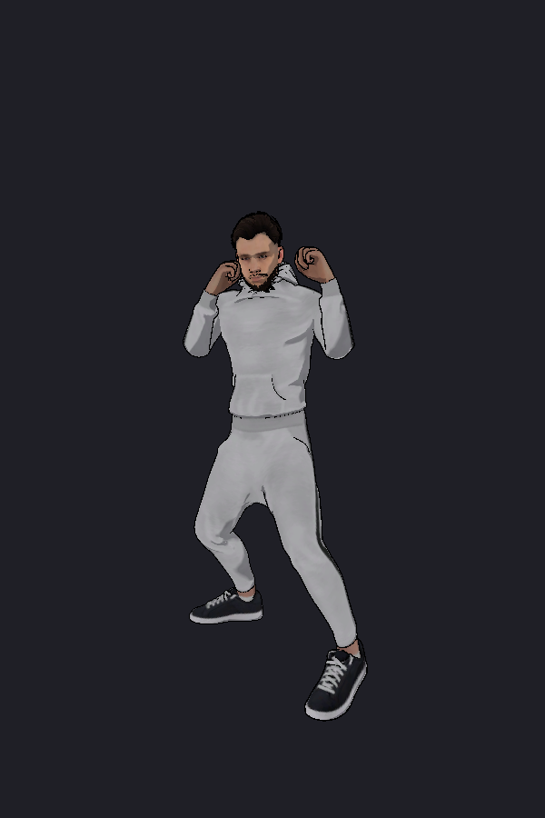

## 色違いの雑魚（2面以降）

挙動と数値は元と同じで、服の色だけが違う個体。2面から素の個体と混ぜて出す。モデルは共有した
まま、`PaletteSwap` がマテリアルの複製に色を書く（元のテクスチャ・メッシュは触らない）。

| 種類 | 元 | 変える所 | 色 | 塗り方 |
|---|---|---|---|---|
| 通常A（黒） | Ch01 | 上半身（ポロシャツ） | 黒 | 掛け算（元が明るいので皺が残る） |
| 通常B（ピンク） | Ch28 | 黒い上下 | ピンク | 単色（元が暗いのでテクスチャを白にして塗る） |
| 通常C（黄） | Ch06 | 上半身の黒（パーカー）のみ。パンツ・帽子・靴・肌はそのまま | 黄 | 単色 |
| 突進（赤） | Ch08 | 下半身（スウェット） | 赤 | 掛け算 |

Ch06 だけは体と服が1メッシュにまとまっているので、三角形の重心の高さ（0.95〜1.62m）と
テクセルの暗さ（0.22 以下）でパーカーだけを切り出して塗っている。

### 通常A（黒）
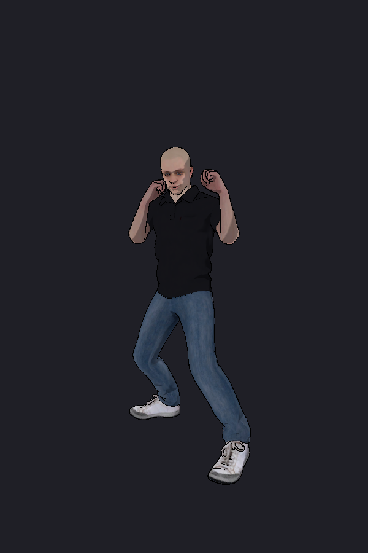

### 通常B（ピンク）
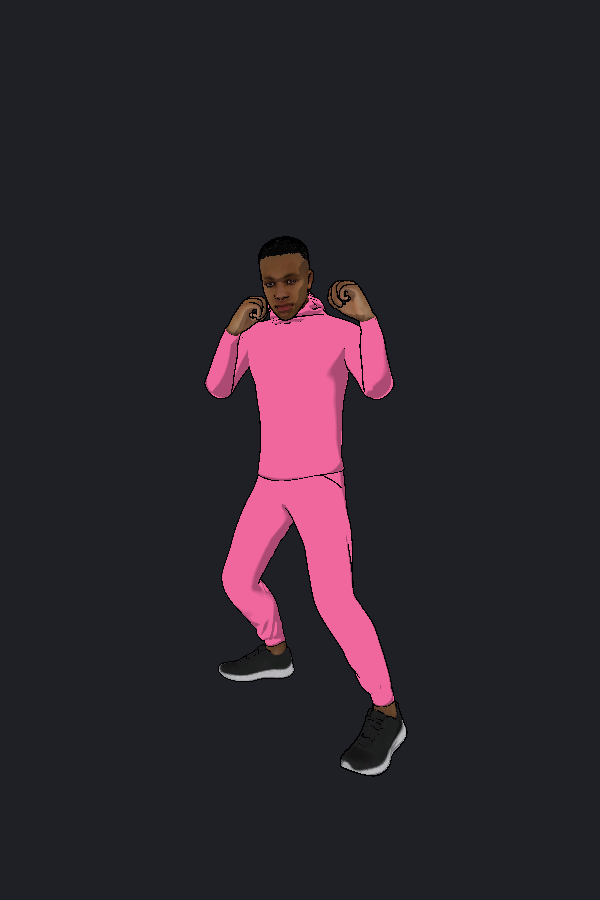

### 通常C（黄）
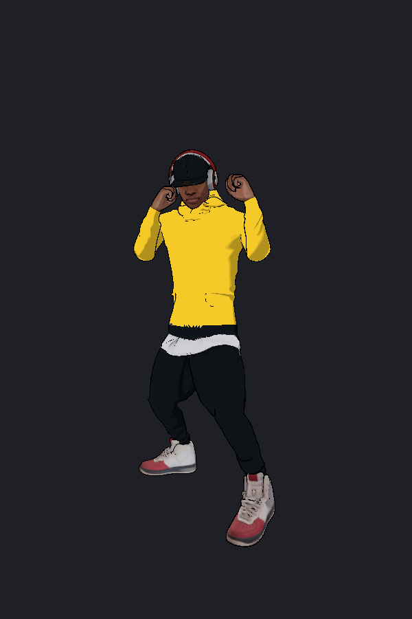

### 突進（赤）
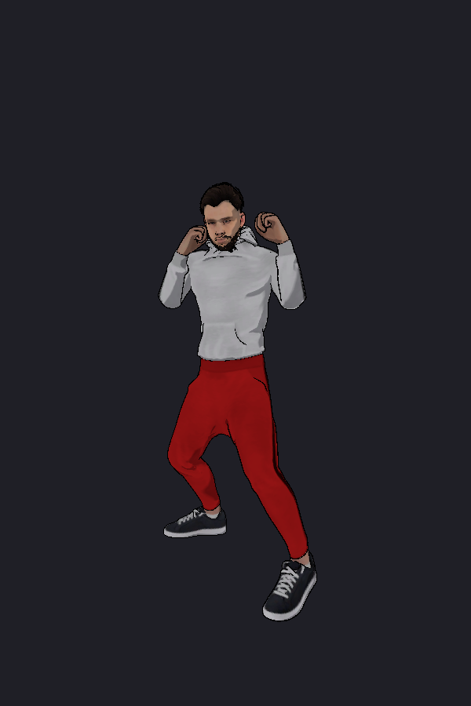

## 雑魚（4面・ゾンビ）

見た目は他の面と同じ（Ch01 / Ch28 / Ch06。色違いも混ぜる）。待機・歩き・攻撃をゾンビの
モーションに差し替えている。

| 種類 | モデル | HP | 攻撃 | 特徴 |
|---|---|---|---|---|
| ゾンビ | Ch01 / Ch28 / Ch06 | 30000 | ゾンビ攻撃 1200（ノックバック 3.0） | 接近 1.05 m/s・奥行き合わせ 1.0 m/s と遅い（通常型は 3.2 / 2.2）。攻撃は予備動作 0.45秒・判定 0.20秒・硬直 0.55秒と大振り。怯まない |
| ゾンビ（Ch30） | Ch30 | 30000 | 同上 | 4面ボス戦にだけ加わる。数値はゾンビと同じで、見た目がこの面の固有 |

待機は `Y Bot@Zombie Idle`（4.000秒）、歩きは `Ch30_nonPBR@Walking`（実測 0.351 m/s の歩幅）、
攻撃は `Ch30_nonPBR@Zombie Attack`（2.633秒、打撃ピーク 1.132秒）。接近速度を落としてあるのは
歩幅に合わせるためで、速いままだと足が滑る。

### ゾンビ（Ch30・ボス戦に参戦）
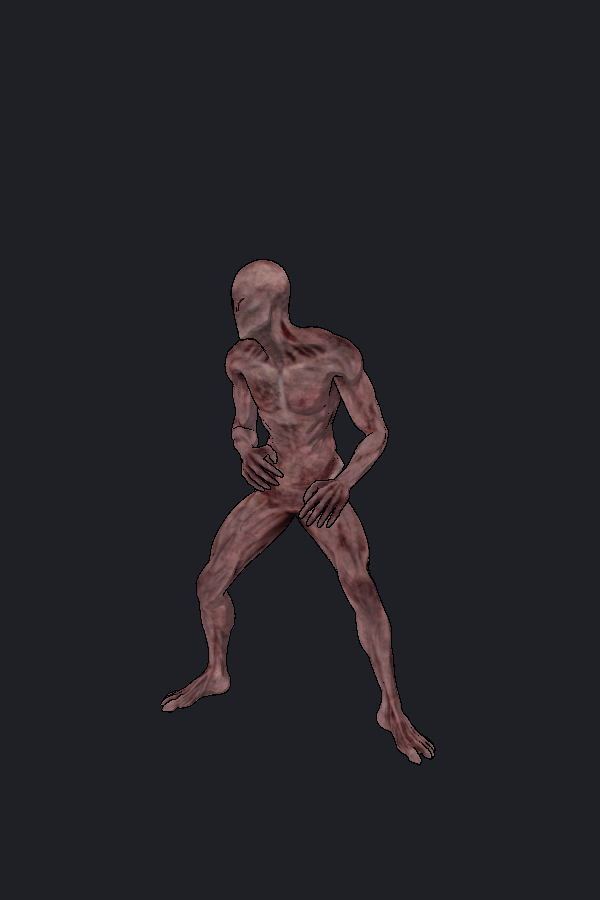

## 5面の増援

ニケが HP 50% / 30% / 15% でそれぞれ2体呼ぶ（計6体）。以下の2種類を1体ずつ交互に出す。数値も
挙動も雑魚と同じ（HP 30000・接近 3.2 m/s・素手 1200／900／1500）で、違うのは見た目だけ。ゾンビ
状態は4面だけなので、待機・歩き・攻撃はすべて通常型のまま。

| 種類 | モデル | HP | 攻撃 | 特徴 |
|---|---|---|---|---|
| ラスボスを守る敵 | Ch18（黒のキャップ・ベスト・カーゴパンツの警備） | 30000 | 素手 1200 | 見た目を `Ch18_nonPBR@Zombie Attack`（With Skin）から取る。使うのは見た目だけで、攻撃は通常型 |
| ニケ素体 | AIニケちゃんの VRM（ヘアピン無し・全身白） | 30000 | 素手 1200 | 4面で床に転がっていた「次の身体」と同じ。VRM は改変せず、ランタイムに全サーフェスを白へ塗る。殴っても怯まない |

### ラスボスを守る敵
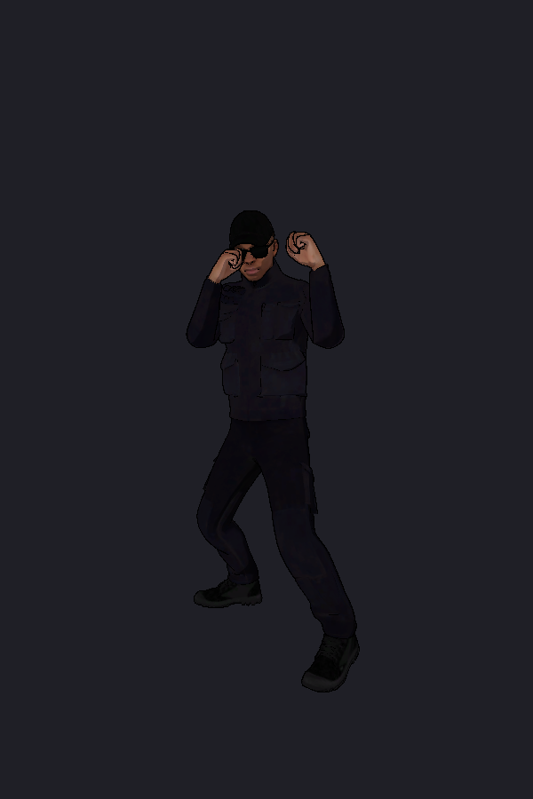

### ニケ素体
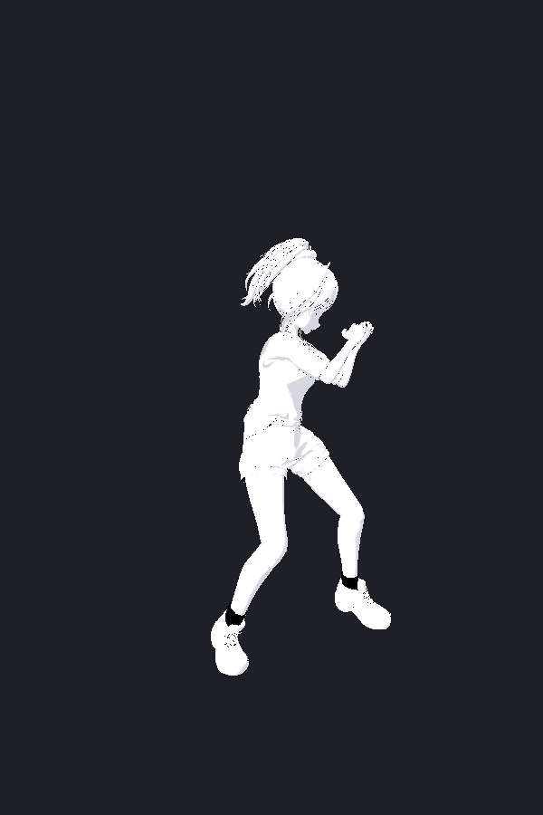

## 面ごとの出現

### 1面 ターミナル・スラム（雑魚 10体）
- ロック1（X=12m）: 通常A ×2 → 通常B ×3
- ロック2（X=28m）: 突進 ×1 → 通常A ×2 → 通常C ×2
- ボス（X=46m）: マスクマン（Ch35）。供回り・増援は無し

### 2面 タイムライン地下鉄（雑魚 13体）
- ロック1（X=12m）: 通常A ×2 → 突進（赤）×1 → 通常C ×3
- ロック2（X=28m）: 通常B（ピンク）×2 → 突進 ×2 → 通常A（黒）×3
- ボス（X=46m）: SWAT（Swat＋日本刀）。供回り・増援は無し

### 3面 Discord湾岸（雑魚 17体）
- ロック1（X=12m）: 突進（赤）×2 → 通常A ×3 → 通常B ×3
- ロック2（X=28m）: 通常A（黒）×3 → 突進 ×2 → 通常C（黄）×4
- ボス（X=46m）: GUNNER（Ch15）。**雑魚は出さない一騎打ち**（供回りも増援も無し）

### 4面 工場（雑魚 5体＋ボス戦の供回り 2体＋HP30% で 4体）
- ロック1（X=7m）: ゾンビ ×2 → ゾンビ（Ch28・ピンク）×2 → ゾンビ（Ch06・黄）×1
- ボス（X=13m で開始、カメラは X=18m に固定）: マッドサイエンティスト（Ch16_boss）。
  AIニケちゃんと同じ姿の身体を盾にする
- ボス戦の開始と同時に、ゾンビ（Ch30）とゾンビ（Ch01）が歩き込む
- ボスの HP30% でゾンビが4体増える（Ch01・Ch28ピンク・Ch06黄を順に使い回す）

### 5面 ポーランドの部屋
- 雑魚の波は無し。ボスが HP 50% / 30% / 15% で、ラスボスを守る敵 ×1 とニケ素体 ×1 を呼ぶ（計6体）
- ボス（X=5m で開始、カメラは X=10m に固定）: ニケ

## ボス

| 面 | 名前（ボスバー） | モデル | HP | poise | 攻撃 | 戦法 |
|---|---|---|---|---|---|---|
| 1 | マスクマン | Ch35（1.15倍） | 90000 | 5600 | 素手 1800 | 通常型の大型版。のけぞりにくい。追走 2.6 m/s |
| 2 | SWAT | Swat＋日本刀（等倍） | 90000 | 5600 | 刀 4000（ノックバック 6.0） | 踏み込み 2.5 m/s で斬る。ガードが固く（構える確率 0.75・正面 160°・1.4秒）、2回受け止めると 0.9 の確率で反撃 |
| 3 | GUNNER | Ch15＋ライフル（1.15倍） | 90000 | 5600 | 銃 5000 ×5発（0.18秒間隔のバースト。次の射撃まで 1.2秒、射程 18m） | 距離 4.5m を保って正面へ撃つ。3.0m まで詰められると下がるが、画面端で止まる。5発は撃ち始めの狙い点へ飛ぶので、撃たれ始めてから段をずらせば残りは当たらない。増援は呼ばない |
| 4 | マッドサイエンティスト | Ch16_boss＋拳銃（等倍） | 70000 | 4000 | 銃 4500（射程 22m、0.9秒間隔、単発） | 身体を正面に抱えて盾にする（正面 120° からの近接を弾く）。盾のままでも 2秒間隔で撃つ。側面・背後から3発で盾を離し、6秒後にまた掴みに行く。放したあとは距離 4.5m を保って撃つ。HP30% でゾンビを4体呼ぶ |
| 5 | ニケ | プレイヤーと同じ VRM（ヘアピン無し・赤シャツ） | 60000 | — | プレイヤーと同じ素手コンボ（5系統） | 鏡写し。射程 1.35m まで詰めてコンボ、0.55m より近いと半歩下がる。短時間（0.7秒）に2回被弾すると 50% でガード（0.9秒。向いている側の近接を弾く）。踊り回復を見るとクールダウンを待たずに詰めてくる。HP 50% / 30% / 15% で増援2体を呼び、1.6秒だけ距離を取る。倒れたら立ち上がらない |

3面・4面のボスは近接しない。接近ステートに入るとそのまま射撃ステートへ移り、距離を取って撃つ
だけになる（4面は盾を掴み直すときだけ人質へ寄る）。

5面のニケはプレイヤーと同じ本体スクリプトなので、poise（のけぞり耐性）は持たない。
使うコンボは `PPP` / `KKK` / `PKPP` / `PKKP` / `PPKPK` の5系統で、素手コンボツリーの全6ルートの
うち最長の `KPPPKPK` だけ使わない。

### 1面 マスクマン（Ch35）
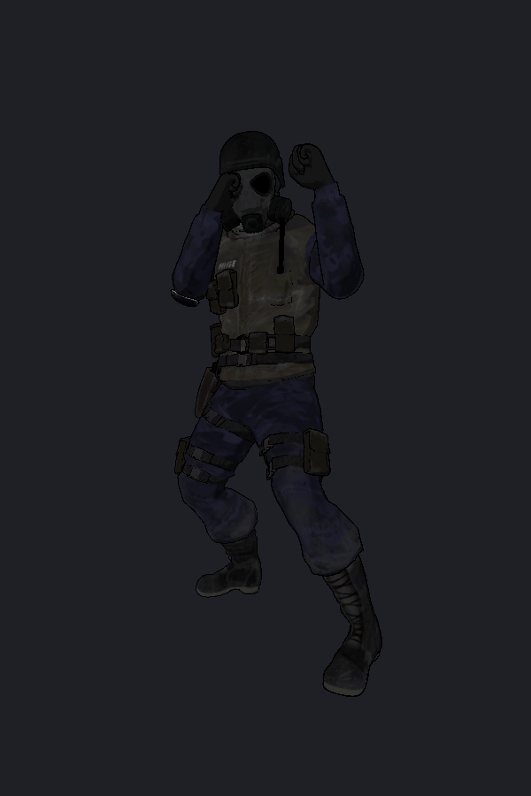

### 2面 SWAT（Swat・日本刀）
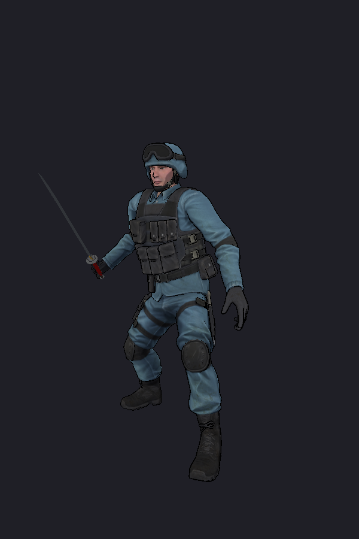

### 3面 GUNNER（Ch15）
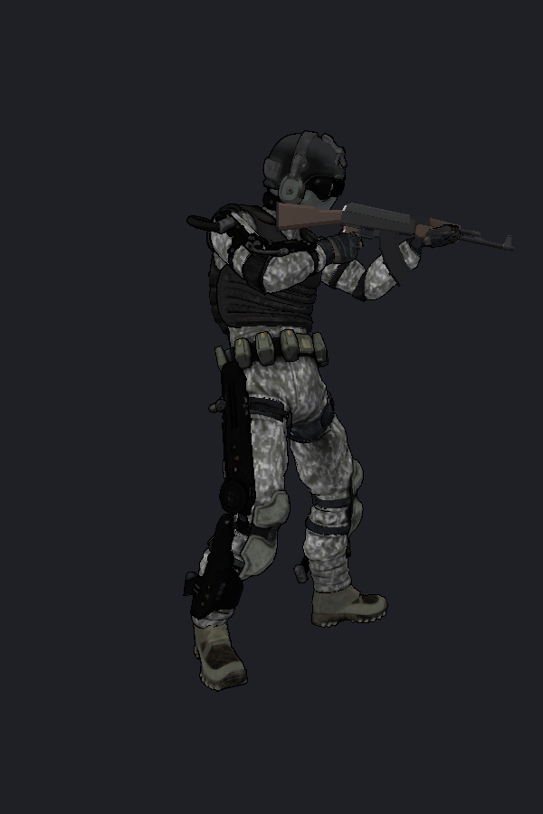

### 4面 マッドサイエンティスト（Ch16_boss・拳銃）
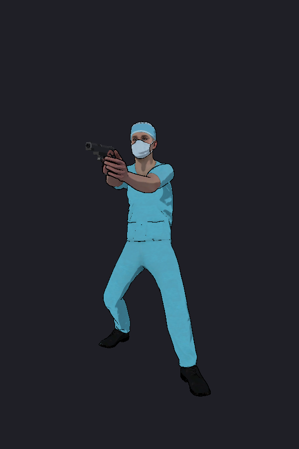

### 5面 ニケ
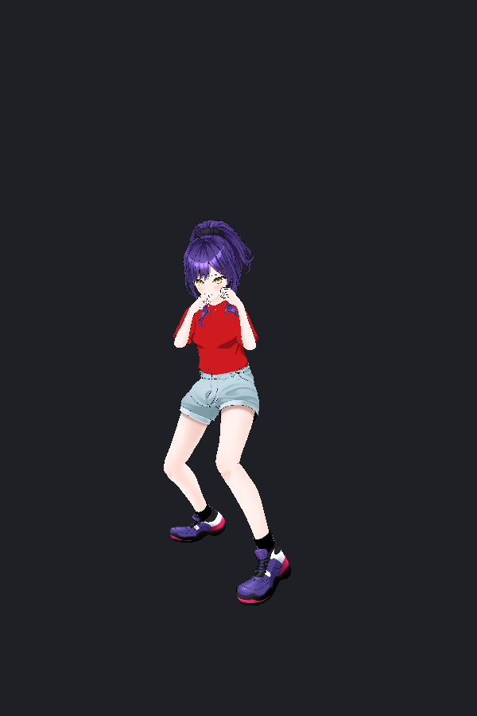
